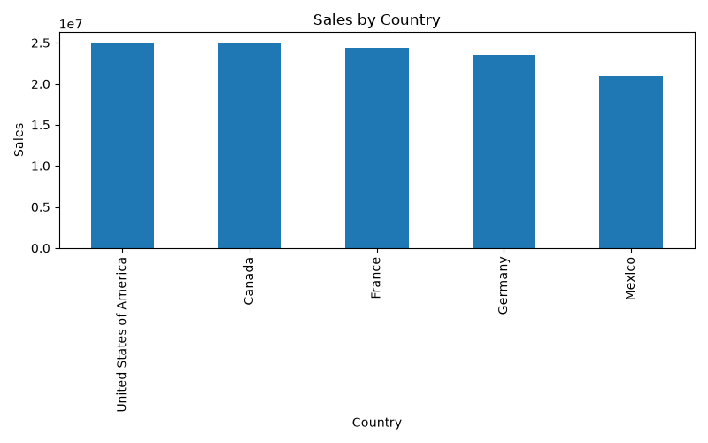
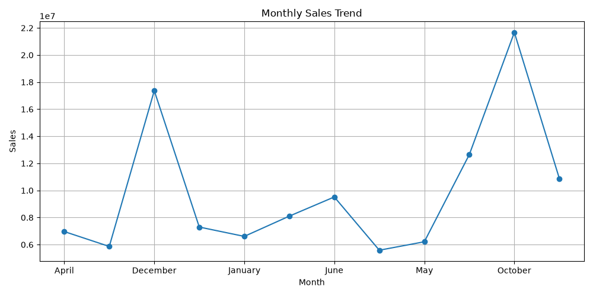
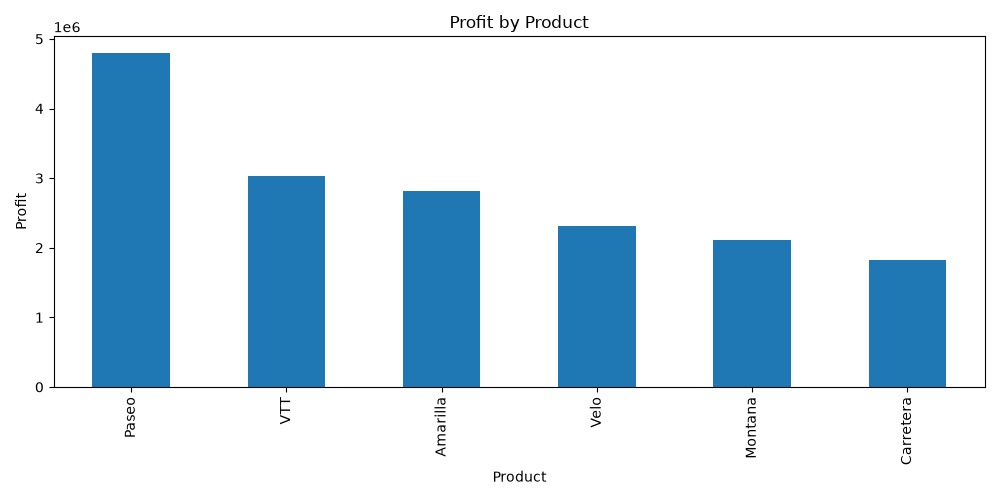
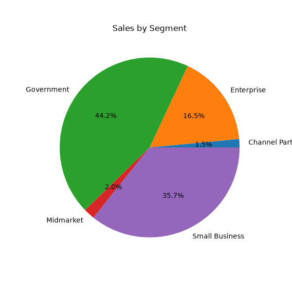

# Financial_Performance_Dashboard
Financial Performance Dashboard using Excel, SQL, Python, and Power BI
# 📊 Financial Performance Dashboard

## Project Overview

This project analyzes a financial dataset using Python to uncover business insights. It demonstrates data cleaning, exploratory data analysis (EDA), and visualization techniques.

## ✨ Features

- Cleaned and preprocessed financial data using Python
- Performed Exploratory Data Analysis (EDA)
- Calculated key business KPIs
- Visualized sales and profit trends
- Analyzed country, product, and customer segment performance
- Created SQL queries for business analysis
- Documented the complete workflow on GitHub

## 📁 Project Structure

```text
Financial_Performance_Dashboard/
│
├── data/
│   ├── raw/
│   └── cleaned/
│
├── python/
│   └── data_cleaning.ipynb
│
├── sql/
│   └── analysis.sql
│
├── dashboard_images/
│
├── README.md
├── requirements.txt
└── LICENSE
```

## Objectives

- Clean and prepare financial data
- Analyze sales and profit trends
- Identify top-performing countries and products
- Compare customer segments
- Generate actionable business insights

## Tools & Technologies

- Python
- Pandas
- NumPy
- Matplotlib
- Jupyter Notebook
- GitHub

## Dataset Features

- Country
- Product
- Segment
- Sales
- Profit
- Units Sold
- Discounts
- Date
- Month Name
- Year

## Key Visualizations

- Sales by Country
- Profit by Product
- Sales by Segment
- Monthly Sales Trend

## Business Insights

- Identified top-performing countries by sales.
- Compared profitability across products.
- Analyzed customer segment contributions.
- Evaluated monthly sales patterns.

## Project Structure

```text
Financial_Performance_Dashboard/
├── data/
├── dashboard_images/
├── python/
├── sql/
├── README.md
└── requirements.txt
```


## 📷 Dashboard Visualizations

### 🌍 Sales by Country



---

### 📈 Monthly Sales Trend



---

### 💰 Profit by Product



---

### 🥧 Sales by Segment




## 💡 Business Recommendations

Based on the analysis:

- Focus marketing efforts on the highest-performing countries.
- Increase inventory for high-profit products.
- Review pricing strategies for lower-profit products.
- Plan promotional campaigns during low-sales months.
- Monitor customer segment performance to improve sales strategies.


## 🛠 Skills Demonstrated

- Data Cleaning
- Exploratory Data Analysis (EDA)
- Data Visualization
- Business Analysis
- SQL Query Writing
- KPI Analysis
- Git & GitHub
- Documentation

## Author

**Suchitra Behera**